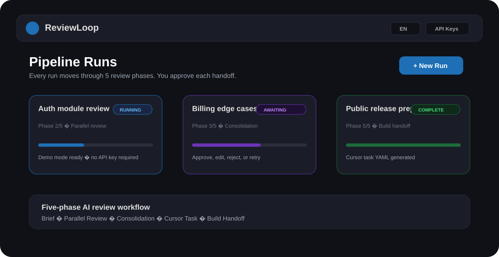

# ReviewLoop

Turn AI code review into a clear, repeatable 5-phase workflow: brief, parallel review, consolidation, Cursor task, and implementation handoff.



[](LICENSE)
[](https://www.python.org/)

## Why This Exists

AI coding works better when review, consolidation, and build instructions are explicit. ReviewLoop gives you a local control room for multi-model review loops:

- **Orchestrator phases** create review briefs, consolidate findings, and produce Cursor-ready tasks.
- **Parallel reviewers** inspect the same task from different perspectives.
- **Human approval gates** keep each handoff explicit and editable.
- **Demo mode** lets new users try the full flow without API keys.

See [docs/concepts.md](docs/concepts.md) for the workflow model.

## Quickstart

### Option A: Docker

```powershell
git clone https://github.com/xMannixx/ReviewLoop.git
cd ReviewLoop
docker compose up --build
```

Open `http://localhost:5000`.

### Option B: Python

```powershell
git clone https://github.com/xMannixx/ReviewLoop.git
cd ReviewLoop
python -m venv .venv
.venv\Scripts\activate
pip install -r requirements.txt
python app.py
```

The public `config.example.toml` uses the built-in demo provider, so the first run works without paid APIs.

## Connect Real Providers

Create `.env` in the project root:

```env
ANTHROPIC_API_KEY=
OPENAI_API_KEY=
GOOGLE_API_KEY=
DEEPSEEK_API_KEY=
```

You only need one real provider to start. Missing reviewer providers are skipped instead of blocking the run.

For local path overrides, copy the example config:

```powershell
copy config.example.toml config.toml
```

`config.toml` and `.env` are intentionally ignored by Git.

## Features

- 5-phase review pipeline with approval gates.
- Demo provider for onboarding, screenshots, and smoke tests.
- Bilingual UI foundation: English and German.
- API keys via session modal or `.env`.
- Workspace file browser for loading code context.
- Token/cache reporting and Markdown exports.
- Optional basic auth via `REVIEWLOOP_BASIC_AUTH_PASSWORD`.
- Optional telemetry via `REVIEWLOOP_TELEMETRY_URL` (disabled by default).
- Docker-ready local deployment.

## Development

```powershell
pip install -r requirements-dev.txt
python -m ruff check app.py pipeline
python -m mypy app.py pipeline
python -m pytest
```

## Configuration

Important sections in `config.example.toml`:

- `[teamleiter]`: technical legacy key for the Orchestrator default provider/model.
- `[[teamleiter_choices]]`: selectable Orchestrator models.
- `[reviewer.*]`: reviewer provider/model/role definitions.
- `[workspace_roots]`: directories the UI may browse.
- `[anthropic]`: optional Anthropic prompt-cache TTL.

The internal key name `teamleiter` is kept for backward compatibility; user-facing UI calls it **Orchestrator**.

## Team Hosting

For a lightweight protected deployment:

```powershell
$env:REVIEWLOOP_BASIC_AUTH_PASSWORD="change-me"
python app.py
```

Use a reverse proxy with HTTPS for anything beyond localhost.

## Project Structure

```text
.
├── app.py
├── config.example.toml
├── docker-compose.yml
├── Dockerfile
├── docs/
├── pipeline/
├── static/
├── templates/
└── tests/
```

## Roadmap

- Hosted deployment templates.
- Stronger team auth and workspace permissions.
- Docs site generated with MkDocs.
- Optional cloud storage adapters.
- Release automation and container publishing.

## License

Apache License 2.0. See [LICENSE](LICENSE).
