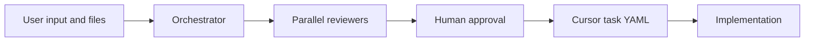

# Concepts

ReviewLoop turns a review-and-build loop into five explicit phases.

## The Five Phases

1. **Review brief**: the Orchestrator turns your goal and selected files into structured YAML.
2. **Parallel review**: one or more reviewers analyze the brief from different perspectives.
3. **Consolidation**: the Orchestrator merges consensus, unique findings, and priorities.
4. **Cursor task**: the Orchestrator creates a focused implementation brief for Cursor.
5. **Build handoff**: the task is written as a YAML file for implementation.

## Roles

- **You** approve, reject, edit, retry, or stop each phase.
- **Orchestrator** coordinates phases 1, 3, and 4.
- **Reviewers** run in parallel in phase 2.
- **Cursor** implements the final YAML task.

## Demo Mode

The public configuration ships with a `demo` provider. It produces deterministic sample outputs without API keys, so new users can understand the workflow before connecting real model providers.

## Safety Defaults

- Local runtime data is written to `data/`.
- Real secrets belong in `.env`; `.env` and `config.toml` are ignored by Git.
- Optional telemetry is disabled unless `REVIEWLOOP_TELEMETRY_URL` is set.
- Optional basic auth is disabled unless `REVIEWLOOP_BASIC_AUTH_PASSWORD` is set.
